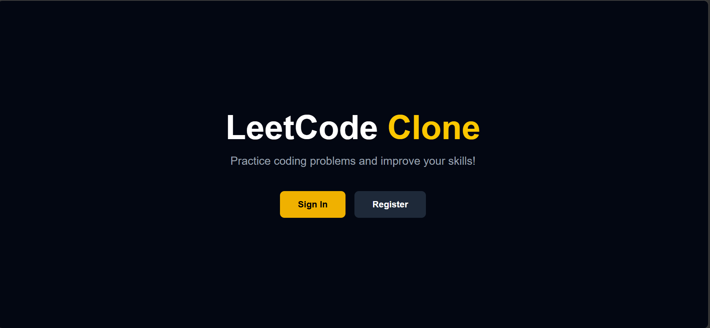
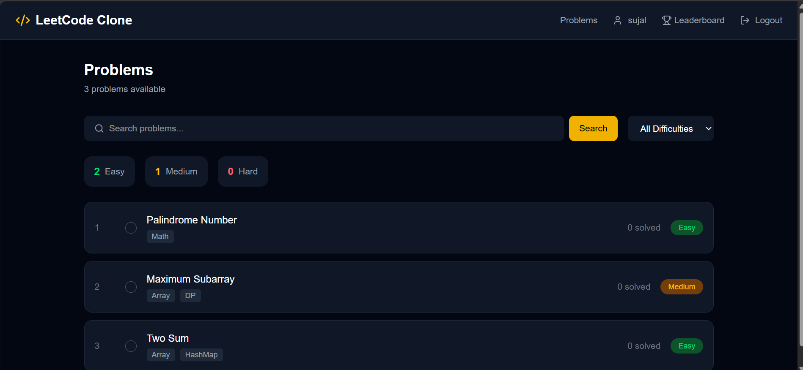
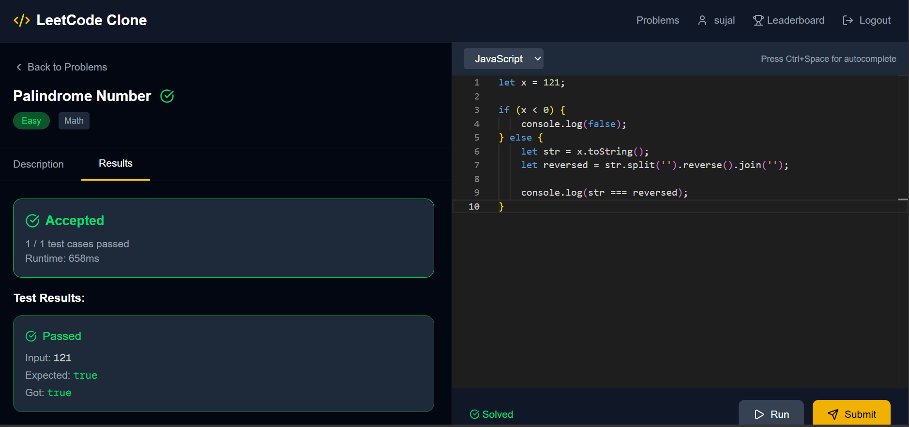
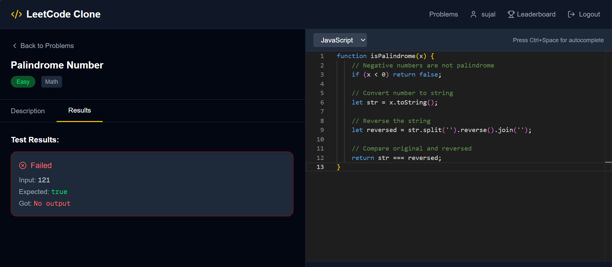
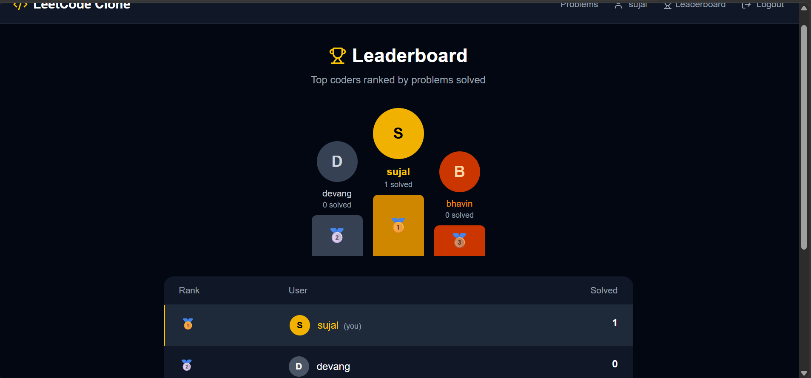
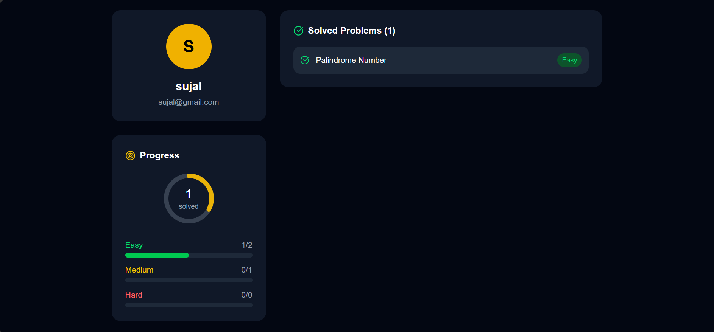

# LeetCode Clone

A full-stack LeetCode clone built with Next.js, Node.js, Express, MongoDB, and Tailwind CSS.

---

## 🚀 Features

- User Authentication
- Solve Coding Problems
- Code Editor Integration
- Test Case Execution
- Discussion Section
- Admin Problem Management
- Responsive Design
- Leaderboard System
- Protected Routes
- Modern UI/UX

---

## 🛠 Tech Stack

### Frontend
- Next.js
- TypeScript
- Tailwind CSS

### Backend
- Node.js
- Express.js
- MongoDB

---

## 📦 Installation

### Clone Repository

```bash
git clone https://github.com/jkbhatt/leetcode-clone.git
```

### Navigate to Project

```bash
cd leetcode-clone
```

### Install Dependencies

```bash
npm install
```

### Run Frontend

```bash
cd client
npm run dev
```

### Run Backend

```bash
npm start
```

---

## 🌐 Live Demo

https://leetcode-clone-black.vercel.app

---

## 📸 Screenshots

### Home Page


### Problem Page


### Problem Solving


### Success Submission


### Failed Submission


### Leaderboard


### Profile Page


---

## 📂 Project Structure

```bash
leetcode-clone/
│
├── client/             # Frontend
├── src/                # Backend Source
├── ScreenShot/         # Project Screenshots
├── README.md
├── package.json
└── .gitignore
```

---

## 🔥 Future Improvements

- AI Problem Recommendations
- Contest System
- Real-Time Code Collaboration
- Code Execution Analytics
- Interview Preparation Mode

---

## 👨‍💻 Author

Jay Bhatt

GitHub: https://github.com/jkbhatt

---

## ⭐ Support

If you like this project, give it a star ⭐ on GitHub.